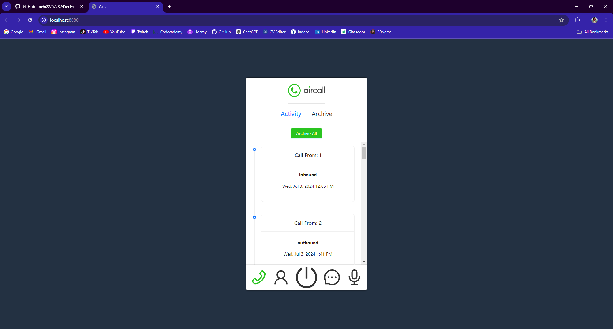
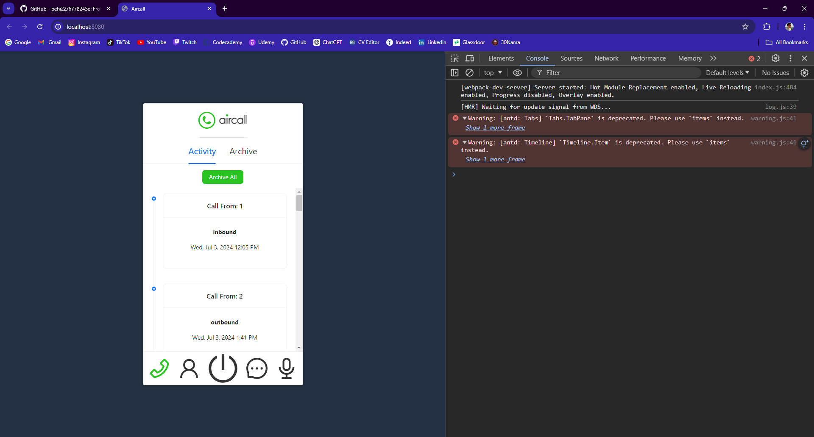

#

Aircall

> Front End Developer Assessment Project - Speer Technologies.
>
> <!--Live demo [_here_]().  If you have the project hosted somewhere, include the link here. -->

## Table of Contents

- [General Info](#general-information)
- [Technologies Used](#technologies-used)
- [Screenshots](#screenshots)
- [Usage](#usage)
- [Project Status](#project-status)
- [Room for Improvement](#room-for-improvement)
- [Acknowledgements](#acknowledgements)
- [Contact](#contact)
<!-- * [License](#license) -->

## General Information

This web application is developed to showcase knowledge of developing responsive and interactive webpages using React and managing the state
of the application with:

- Focus on design sense (Paying attention to the UI/UX and transitions)
- React Best Practices
- Code Readability and Maintainability

<!-- You don't have to answer all the questions - just the ones relevant to your project. -->

## Technologies Used

- npm - 8.15.0
- React.js
- antd - 5.19.2
- HTML - version html5
- CSS
- git version 2.38.1.windows.1
- github

## Screenshots

## Usage

The app should have the following features:

- **Activity Feed** - simple list of calls
- **Activity Detail** - detail of a call
- **Archive** - the final user should be able to archive (and unarchive) a call. Archived calls will no longer be displayed on the Activity Feed and should have a separate Archived Tab.
- A button to archive all calls in the activity feed
- A button to unarchive all calls in the archived calls tab

## Project Status

Project is: Semi-Complete (Demo)

## Room for Improvement

- There is an issue currently with deprecation which I didn't have the time to fix in my 48 hours.

- The Footer can be improved to consist of actual buttons with functions instead of icons. I also didn't find time to write helper functions to fix the phone numbers fetched from the API.

## Acknowledgements

- Many thanks to Speer Technologies for including me in their Front End Developer assessment project.

## Contact

Created by Behbod Babai - feel free to contact me via email!
my email: behibabai@gmail.com

<!-- Optional -->
<!-- ## License -->
<!-- This project is open source and available under the [... License](). -->

<!-- You don't have to include all sections - just the one's relevant to your project -->
